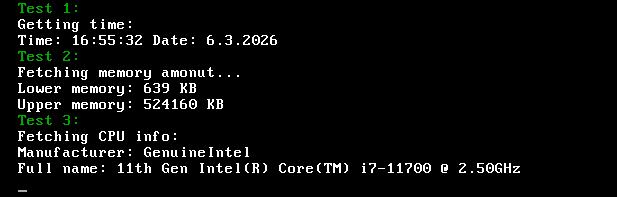
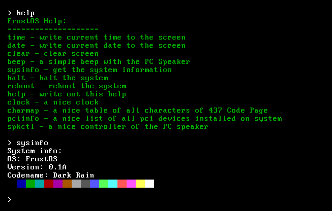

FrostOS
---

  
  

A hobby OS made for self-learning.

## What it can do:
- display some text via VGA
- reboot
- take input from keyboard
- make sound with a PC speaker
- get time and date (NO UTC SUPPORT)
- some PCI things
- ACPI detection

## Target:
- Make it work on real hardware. (It is already, just be sure every release works)
- More soon ;)
