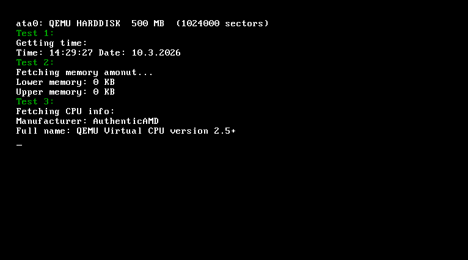
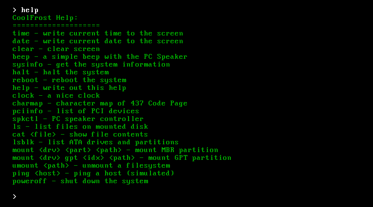

CoolFrost
---

<p align="center">
  
  
</p>

> [!WARNING]
> I AM NOT RESPONSIBLE IF ANYTHING WILL HAPPEN WITH YOUR DEVICE. THERE SHALL
> BE NO EXPECTATIONS THE SYSTEM WOULD WORK PERFECTLY ON ANY MACHINE.

A hobby x86_64 OS made for self-learning. Originally forked from FrostOS and fully ported to 64-bit long mode.

## What it can do:
- Boots via GRUB2 + Multiboot2 into 64-bit long mode
- VGA text mode output with color attributes
- PS/2 keyboard input with insert-mode editing and arrow key navigation
- RTC time and date reading
- PC speaker sound control
- CPUID: reads CPU manufacturer and full name
- PCI device enumeration and detailed info viewer
- GPU detection via PCI class scan (NVIDIA / AMD / Intel / VMware)
- PCIe capability detection: generation (Gen1–Gen4) and link width (x1–x16)
- ATA PIO disk access with 28-bit and 48-bit LBA support
- GPT and MBR partition table reading
- VFS with auto-mount on boot
- FAT32 filesystem (read-only)
- ext2/ext3/ext4 filesystem (read-only)
- NTFS filesystem (read-only)
- Shell commands: `help`, `sysinfo`, `time`, `date`, `clear`, `halt`, `reboot`, `poweroff`
- Shell commands: `ls`, `cat`, `lsblk`, `mount`, `umount`
- Shell commands: `pciinfo`, `gpuinfo`, `clock`, `charmap`, `beep`, `spkctl`, `ping`
- ACPI S5 shutdown (works in QEMU PIIX4/Q35 and Bochs)

## Building:
```
make kernel.elf
```
Requires `x86_64-elf-gcc`, `x86_64-elf-ld`, `nasm`, and GRUB2 with `grub-mkrescue`.

## Running:
```
qemu-system-x86_64 -cdrom CoolFrost.iso
```

## Target:
- Improve hardware compatibility and test on real machines
- Add writable filesystem support
- More soon ;)
